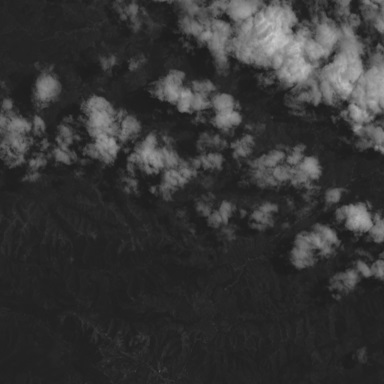
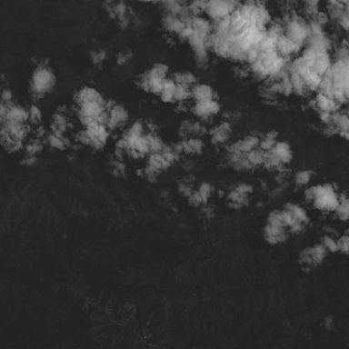
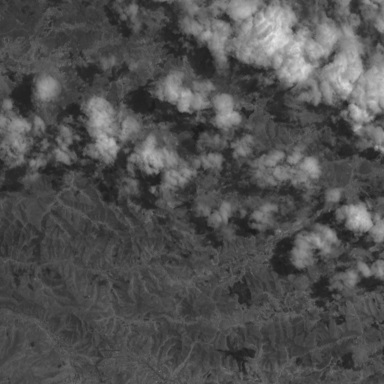
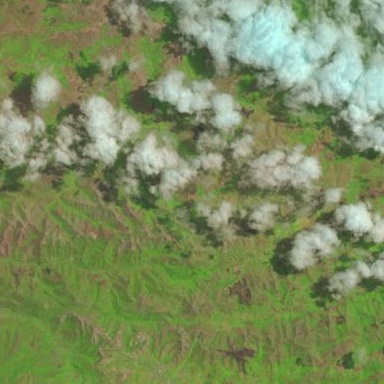
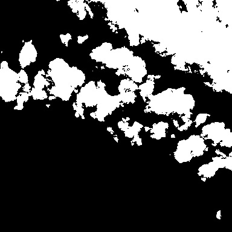

# 38-Cloud: A Cloud Segmentation Dataset
This dataset includes 38 [Landsat 8](https://www.usgs.gov/land-resources/nli/landsat/landsat-8?qt-science_support_page_related_con=0#qt-science_support_page_related_con) scene images and their manually extracted pixel-level ground truths for cloud detection. 38-Cloud dataset is introduced in [1](https://arxiv.org/pdf/1901.10077.pdf), yet it is a modification of the dataset in [2](https://ieeexplore.ieee.org/document/8547095).  
The entire images of these scenes are cropped into multiple 384*384 patches to be proper for deep learning based semantic segmentation. There are 8400 patches for training and 9201 patches for testing.
Each patch has 4 corresponding spectral channels which are Red (band 4), Green (band 3), Blue (band 2), and Near Infrared (band 5). Unlike other computer vision images, these channels are not combined together. Instead, they are in their correspondig directories. The following the directory tree of this dataset is as follows:

  
├──38-Cloud_training  
│------------├──train_red  
│------------├──train_green  
│------------├──train_blue  
│------------├──train_nir  
│------------├──train_gt  
│------------├──Natural_False_Color  
│------------├──Entire_scene_gts  
│------------├──training_patches_38-Cloud.csv  
│------------├──training_sceneids_38-Cloud.csv  
├──38-Cloud_test     
│------------├──test_red  
│------------├──test_green  
│------------├──test_blue  
│------------├──test_nir  
│------------├──Natural_False_Color  
│------------├──Entire_scene_gts  
│------------├──test_patches_38-Cloud.csv  
│------------├──test_sceneids_38-Cloud.csv   

***Click [here](http://goo.gl/nW1hQz) for downloading the dataset***
  
### Landsat 8 Spectral Ranges:   

| Band #  | Name | Spectral Range (nm) |
| ------------- | ------------- |------|
| 2  | Blue  | 450-515|
| 3  | Green  | 520-600|
| 4  | Red  | 630-680|
| 5  | Nir  |845-885|

### Example Images:
Below is an example of a training patch:  

 
  

     
  
  

 

 
  

 

 
  

 

 
  

 

 
  

 

 
  

&emsp;&emsp;&emsp;&emsp;Red &emsp;&emsp;&emsp;&emsp;&emsp;&emsp; Green &emsp;&emsp;&emsp;&emsp;&emsp; Blue &emsp;&emsp;&emsp;&emsp;&emsp; NIR &emsp;&emsp;&emsp;&emsp;&emsp; False Color&emsp;&emsp;&emsp; Ground truth
  
### Some Important Points:
1. Thin clouds (haze) are also considered as clouds (as well as thick clouds).
2. Natural color images are false color images used for further visualization purposes. They have not used in the training and test phase of \[1] and \[2]\.  
3. Some of the patches do not have useful information (0 pixel values) in them. That is because of black margins around the Landsat 8 images.

If you found this dataset useful for your research please cite these two papers:   

@article{38-cloud-1,  
  author    = {S. Mohajerani and  
               P. Saeedi},  
  title     = {Cloud-{N}et: {A}n end-to-end Cloud Detection Algorithm for {L}andsat 8 Imagery},  
  journal   = {CoRR},  
  volume    = {abs/1901.10077},  
  year      = {2019},  
  archivePrefix = {arXiv},  
}

@INPROCEEDINGS{38-cloud-2,   
author={S. Mohajerani and T. A. Krammer and P. Saeedi},   
booktitle={2018 IEEE 20th International Workshop on Multimedia Signal Processing (MMSP)},   
title={A Cloud Detection Algorithm for Remote Sensing Images Using Fully Convolutional Neural Networks},   
year={2018},    
pages={1-5},   
doi={10.1109/MMSP.2018.8547095},   
ISSN={2473-3628},   
month={Aug},  
}

---- 
[1] S. Mohajerani, T. A. Krammer and P. Saeedi, "A Cloud Detection Algorithm for Remote Sensing Images Using Fully Convolutional Neural Networks," 2018 IEEE 20th International Workshop on Multimedia Signal Processing (MMSP), Vancouver, BC, 2018, pp. 1-5.
doi: 10.1109/MMSP.2018.8547095
URL: http://ieeexplore.ieee.org/stamp/stamp.jsp?tp=&arnumber=8547095&isnumber=8547039  

[2] S. Mohajerani and P. Saeedi, “Cloud-Net: An end-to-end
cloud detection algorithm for Landsat 8 imagery,”
CoRR, vol. abs/1901.10077, 2019.
URL: https://arxiv.org/pdf/1901.10077.pdf
